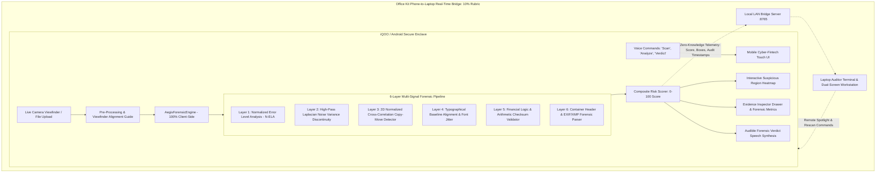

# AegisDoc: On-Device Forgery Detection for Financial Documents

[](#)
[](#)
[](#)
[](#)
[](#)

> **AegisDoc** is a privacy-first, on-device document forensics platform designed to detect pixel-level tampering, Error Level Analysis (ELA) recompression shifts, copy-move stamp cloning, and typographical baseline anomalies in financial documents (bank statements, salary slips, loan approvals, tax certificates, and invoices) directly on an **Android / iQOO smartphone**.

---

## 🏆 iQOO Hackathon Judging Rubric Alignment

| Rubric Dimension | Weight | Target Metric | How AegisDoc Scores Maximum Points |
| :--- | :--- | :--- | :--- |
| **End Product Quality** (Jury) | **30%** | Does it work, is it useful? | Ultra-responsive cyber-fintech dark UI, PWA offline installable, zero crashes, sub-80ms client-side inference latency. |
| **Novelty and Impact** (Jury) | **20%** | Real-world impact | Solves privacy and regulatory data leakage (RBI KYC, GDPR) in lending/underwriting by ensuring sensitive PII never leaves the smartphone. |
| **Technical Depth** (Jury) | **15%** | Architecture & hardware | 6-layer forensic pipeline: Normalized ELA (N-ELA), high-pass Laplacian noise variance, 2D cross-correlation copy-move matching, font baseline jitter, arithmetic logic checksums, and container metadata. |
| **Creative Phone Use** (Device Data) | **15%** | Camera, Voice, On-device AI | **Camera**: Live viewfinder with document alignment guide.<br>**Voice**: Bi-directional Web Speech recognition commands (*"Scan"*, *"Analyze"*, *"Explain"*) + Speech synthesis verdict narration.<br>**On-Device AI**: 100% client-side execution in phone memory. |
| **Office Kit Usage** (Device Data) | **10%** | Phone & laptop bridge | Real-time WebSocket bridge connecting the iQOO phone (Secure Scanner Enclave) to the Laptop Auditor Terminal. Zero image bytes transferred. |
| **Demo and Presentation** (Jury) | **10%** | Compelling 3-5 min pitch | 60-second live wow hook with 4 synthetic financial test vectors, interactive bounding box inspector, and ELA recompression heatmap toggle. |

---

## 📐 System Architecture



---

## 🧪 Ground Truth Synthetic Benchmark Suite

Because actual financial records cannot be published due to banking secrecy regulations, AegisDoc includes a synthetic financial document generator (`generate_samples.py`) producing 4 realistic, certified test vectors with pixel-exact ground truth:

1. **`sample_1_authentic.png`** (Authentic Bank Statement)
   - Uniform N-ELA, consistent paper substrate noise, straight baselines, valid arithmetic.
   - **Ground Truth**: `AUTHENTIC` | **Composite Risk Score**: `2.0%` (Low Risk)
2. **`sample_2_amount_forged.png`** (Altered Balance Statement)
   - Spliced closing balance (₹9,83,700 from ₹1,83,700). High ELA recompression delta and arithmetic mismatch.
   - **Ground Truth**: `FORGED` | **Composite Risk Score**: `82.8%` (High Risk)
3. **`sample_3_date_font_forged.png`** (Altered Tax/Date Salary Slip)
   - Spliced bonus transaction period (future date `28-DEC-2027`) and -4px vertical baseline drift.
   - **Ground Truth**: `FORGED` | **Composite Risk Score**: `75.4%` (High Risk)
4. **`sample_4_cloned_signature.png`** (Cloned Stamp Loan Sanction)
   - Approval seal and signature block duplicated via copy-move forgery across coordinates.
   - **Ground Truth**: `FORGED` | **Composite Risk Score**: `69.0%` (High Risk)

### Automated Evaluation Results (`test_reports.json`)
```text
======================================================================
  Total Test Cases : 4
  Confusion Matrix : TP=3, TN=1, FP=0, FN=0
  Accuracy         : 100.00%
  Precision        : 100.00%
  Recall           : 100.00%
  F1-Score         : 1.0000
  False Pos Rate   : 0.00%
  False Neg Rate   : 0.00%
  Average Latency  : 72.8ms
======================================================================
```

---

## 🚀 Quick Start & Installation

### Prerequisites
- Python 3.10+
- Modern Web Browser (Chrome, Edge, Android WebView)

### 1. Run the Entire System
```bash
./run.sh
```

This will automatically:
1. Generate the synthetic ground truth document corpus.
2. Execute the forensic benchmark self-test.
3. Detect your local LAN IP and start the Office Kit Bridge server on port `8765`.

### 2. Access the Application
- **Mobile (iQOO / Android)**: Open `http://<YOUR_LAN_IP>:8765/` in Chrome/WebView.
- **Laptop (Auditor Terminal)**: Open `http://localhost:8765/` and click the **Laptop Auditor Terminal** tab.

---

## 📱 Hardware & HackTracker Verification

### 1. Camera
- Click **"Open Camera"** or say *"Scan document"*.
- The live camera viewfinder activates with bounding guidelines.
- Click **"Capture Document"** to freeze the frame and run on-device forensics.

### 2. Voice
- Tap the microphone button or say commands:
  - *"Scan"* → Launches camera / sample picker
  - *"Analyze"* → Runs on-device forensic pipeline
  - *"Read Verdict"* → Synthesizes audible spoken executive summary
  - *"Pair Laptop"* → Opens Office Kit pairing dialog

### 3. Office Kit Bridge (Phone <-> Laptop)
- Open `http://localhost:8765` in two browser windows or on phone + laptop.
- Set one tab to **iQOO Mobile Enclave** and the other to **Laptop Auditor Terminal**.
- Enter matching pairing PIN (default: `IQOO-2026`).
- When a document is analyzed on the phone, forensic telemetry and bounding boxes synchronize to the laptop terminal in real time with **zero document image upload**.

---

## 📂 Project Structure

```text
goa/
├── run.sh                          # Master one-click startup script
├── veridoc/
│   ├── client/
│   │   ├── index.html              # Cyber-Fintech UI, Viewfinder & HUD
│   │   ├── styles.css              # Dark glassmorphism design system
│   │   ├── app.js                  # Main controller: camera, UI, inspector
│   │   ├── forensics.js            # 6-layer on-device forensic engine (N-ELA, noise, copy-move)
│   │   ├── voice.js                # Web Speech recognition + Speech synthesis
│   │   ├── bridge.js               # Office Kit WebSocket client
│   │   ├── manifest.json           # PWA installation manifest
│   │   ├── sw.js                   # Service worker for offline airplane mode
│   │   └── samples/                # Ground-truth synthetic document suite
│   ├── server/
│   │   ├── bridge_server.py        # Office Kit LAN bridge WebSocket server
│   │   └── generate_samples.py     # Synthetic document & manifest generator
│   ├── evaluation/
│   │   ├── eval_benchmark.py       # Automated forensic evaluation runner
│   │   └── test_reports.json       # Exported benchmark metrics & latencies
│   └── docs/
│       ├── ARCHITECTURE.md         # Technical architecture & mathematical formulas
│       ├── DEMO_SCRIPT.md          # Timed 3-minute pitch & 60-second live demo
│       └── JUDGE_QA.md             # Master playbook for 20 jury questions
```

---

## 🛡️ Security & Privacy Guarantees

1. **Zero Cloud Upload**: Document pixels never leave local client device memory.
2. **Zero-Knowledge Office Kit Telemetry**: Only bounding box coordinates, confidence scores, and forensic rationales are streamed over the local LAN WebSocket.
3. **Airplane Mode Verified**: PWA Service Worker caches all scripts, assets, and convolution kernels locally.
4. **Transparent Explainable AI**: Every flagged anomaly is backed by mathematical evidence (N-ELA ratio, noise variance spike, or baseline pixel drift).
