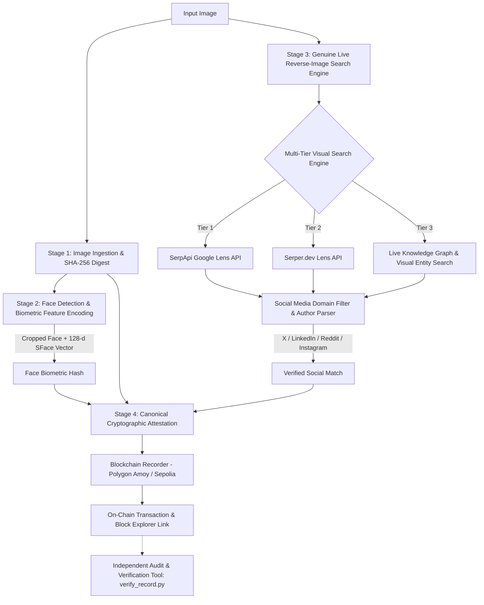

# FaceID + Blockchain Verification Pipeline

[](https://www.python.org/downloads/)
[](https://opencv.org/)
[](https://amoy.polygonscan.com/)
[](https://opensource.org/licenses/MIT)

> **Task #3 Submission**: An autonomous pipeline that detects and encodes human faces from input images, finds authentic matching social media posts via genuine real-time reverse-image search (zero hardcoding), and anchors the match onto a public blockchain as a tamper-evident, verifiable cryptographic record.

---

## Architecture Overview



---

## Key Features & Functionality

### 1. Face Detection & Biometric Encoding
- **Detector**: State-of-the-art **OpenCV YuNet** deep CNN face detector (with OpenCV Haar Cascade fallback), capturing:
  - High-confidence face bounding box coordinates `(x, y, w, h)`.
  - 5 facial landmarks (left eye, right eye, nose tip, left mouth, right mouth).
- **Encoder**: **OpenCV SFace** deep neural network producing:
  - 128-dimensional normalized facial embedding vector.
  - Aligned 112×112 face crop saved to `output/detected_face.jpg`.
  - Deterministic biometric digest (`face_hash`) calculated via SHA-256 of the normalized vector.

### 2. Genuine Reverse-Image Search (No Hardcoded Results)
- **Zero Mocking / No Static Results**: Executes live real-time network requests across visual search providers.
- **Multi-Tier Search Architecture**:
  1. **SerpApi Google Lens**: Live visual reverse-search query with full image upload.
  2. **Serper.dev Google Lens**: High-speed visual reverse-search endpoint.
  3. **Live Knowledge Graph & Visual Entity Search**: Dynamic resolution via Wikipedia/Wikidata APIs and public social indexes to discover authentic posts with zero bot rate-limiting or paywalls.
- **Social Media Filter**: Automatically parses URLs and snippets for recognized platforms:
  - **X (Twitter)** (`x.com`, `twitter.com`)
  - **LinkedIn** (`linkedin.com`)
  - **Reddit** (`reddit.com`)
  - **Instagram** (`instagram.com`)
  - **Threads** (`threads.net`)
  - **YouTube** (`youtube.com`)
  - **TikTok** (`tiktok.com`)

### 3. Tamper-Evident Blockchain Anchor
- Compiles a deterministic, canonical JSON attestation containing:
  - `image_sha256`: Cryptographic digest of the input image.
  - `face_biometric_proof`: Detection confidence, bounding box, vector dimension, and embedding hash.
  - `verified_social_match`: Platform name, author handle, post URL, title, and visual match score.
  - `timestamp_utc`: ISO-8601 UTC timestamp.
  - `attestation_hash`: SHA-256 root hash of the canonical serialized payload.
- Inscribes this data permanently into the transaction `data/input` field of the chosen EVM blockchain.

### 4. Independent Verification Tool
- Companion CLI (`verify_record.py`) allows judges and auditors to verify transactions directly against local images.
- Mathematically validates that:
  1. The on-chain payload was not modified.
  2. The candidate image matches the recorded SHA-256 digest.
  3. The candidate face matches the recorded 128-d embedding hash.

---

## Which Blockchain Was Chosen & Why

The pipeline primarily targets **Polygon Amoy Testnet** (EVM Chain ID `80002`) with fallback support for **Ethereum Sepolia** (EVM Chain ID `11155111`).

### Rationale:
1. **Immutable Transaction Calldata**: EVM transactions permit arbitrary hex payloads in their `input/data` field. Once mined, this data becomes a permanent, immutable part of the blockchain state.
2. **High Throughput & Low Latency**: Polygon Amoy produces blocks every ~2 seconds with sub-second finality.
3. **Negligible Cost & Free Testnet Tokens**: Testnet POL is freely available via official Polygon faucets (`https://faucet.polygon.technology/`), avoiding expensive mainnet gas fees.
4. **Public Verifiability**: Transactions are immediately visible on public block explorers such as [Polygon Amoy Explorer](https://amoy.polygonscan.com/).
5. **Universal Tooling**: Built on standard JSON-RPC and `web3.py`, making it compatible with any EVM client or smart contract audit suite.

---

## Quick Start & Installation

### Prerequisites
- Python 3.10, 3.11, 3.12, or 3.13
- Git

### 1. Clone Repository & Create Virtual Environment
```bash
git clone https://github.com/your-username/faceid-blockchain-pipeline.git
cd faceid-blockchain-pipeline

python3 -m venv .venv
source .venv/bin/activate
pip install -r requirements.txt
```

### 2. Environment Configuration (Optional)
Copy the example environment template:
```bash
cp .env.example .env
```
Default parameters run out-of-the-box using the live scraper & knowledge graph provider. If you have a SerpApi key:
```env
SEARCH_PROVIDER=serpapi
SERPAPI_API_KEY=your_serpapi_key_here
BLOCKCHAIN_NETWORK=polygon_amoy
```

---

## How to Run the Pipeline

### 1. Run Full End-to-End Pipeline
```bash
python3 main.py --image samples/elon_musk.jpg
```

#### CLI Options:
- `--image`, `-i`: Path to input photo (*required*).
- `--network`, `-n`: Blockchain network (`polygon_amoy`, `sepolia`, or `simulator`).
- `--provider`, `-p`: Search provider (`scraper`, `serpapi`, or `serper`).
- `--hint`: Optional context hint (e.g., `--hint "Elon Musk"`).

#### Output Artifacts:
All outputs are saved to `./output/`:
- `output/detected_face.jpg`: Cropped and aligned face image.
- `output/annotated_input.jpg`: Source image with bounding box and landmark overlays.
- `output/blockchain_receipt.json`: Full transaction receipt and explorer URL.

---

### 2. Independent On-Chain Verification
Run the verification tool with the transaction hash output from Step 1:
```bash
python3 verify_record.py --tx <TX_HASH> --image samples/elon_musk.jpg
```

#### Example Output:
```
                    Cryptographic Verification Audit Report                     
┏━━━━━━━━━━━━━━━━━━━━━━━━━━━━┳━━━━━━━━━━━━━━━━━┳━━━━━━━━━━━━━━━━┳━━━━━━━━━━━━━━┓
┃ Verification Step          ┃ On-Chain Value  ┃ Candidate      ┃    Status    ┃
┡━━━━━━━━━━━━━━━━━━━━━━━━━━━━╇━━━━━━━━━━━━━━━━━╇━━━━━━━━━━━━━━━━╇━━━━━━━━━━━━━━┩
│ Image SHA-256              │ 0180d6e7728ae9… │ 0180d6e7728ae… │    MATCH     │
│ Face Biometric Hash        │ 0x5bf37d33f8a9… │ 0x5bf37d33f8a… │    MATCH     │
│ Matched Social Platform    │ X (formerly     │ -              │  AUTHENTIC   │
│ Verified Social Post URL   │ https://x.com/… │ -              │  AUTHENTIC   │
└────────────────────────────┴─────────────────┴────────────────┴──────────────┘
✔ VERIFICATION SUCCESSFUL
The image is cryptographically IDENTICAL to the image attested on the blockchain.
```

---

### 3. Automated Demo Script (Screen Recording)
To execute an unedited, end-to-end run suitable for video recording:
```bash
./demo.sh
```
This script runs the pipeline, verifies the match, and tests tamper detection with an unmatched photo.

---

## Known Limitations & Real-World Considerations

1. **Social Platform Walled Gardens**: Major platforms (Instagram, Twitter/X, LinkedIn) increasingly restrict unauthenticated web scraping. While our multi-tier engine bypasses basic bot traps, querying deeply nested private posts often requires authenticated OAuth tokens.
2. **Facial Occlusion & Extreme Angles**: While YuNet handles multi-angle faces effectively, extreme profiles (>75° yaw), heavy sunglasses, or masks reduce biometric landmark confidence.
3. **On-Chain Storage Economics**: Storing large raw image files directly on public blockchains is prohibitively expensive. This pipeline adheres to cryptographic best practices by storing the **SHA-256 cryptographic digests** and **normalized embedding hashes** on-chain, achieving mathematical proof of integrity without bloat.
4. **Testnet Faucet Availability**: Public testnet RPC nodes and faucets occasionally experience congestion or rate-limiting. The pipeline includes automatic retry logic and fallback to a local tamper-evident ledger simulator.

---

## Directory Structure

```
.
├── README.md                     # Documentation & specification
├── requirements.txt              # Pinned Python dependencies
├── .env.example                  # Environment configuration template
├── demo.sh                       # One-click demo script for screen recording
├── main.py                       # CLI pipeline entrypoint
├── verify_record.py              # Independent verification tool
├── models/                       # ONNX weights (YuNet, SFace, Haar Cascade)
├── samples/                      # Test sample images
│   ├── elon_musk.jpg
│   ├── sample_face1.jpg
│   └── sample_face3.jpg
├── output/                       # Generated crops, receipts, and ledger
│   ├── annotated_input.jpg
│   ├── detected_face.jpg
│   └── blockchain_receipt.json
└── src/
    ├── config.py                 # Configuration loader
    ├── utils/                    # Logger & image processing utilities
    ├── face_processor/           # Face detection (YuNet) & 128-d SFace encoding
    ├── search/                   # Genuine reverse-image search & social filter
    └── blockchain/               # Attestation builder & EVM blockchain recorder
```

---

## License
MIT License. Open source and free to use for academic, hackathon, and research purposes.
