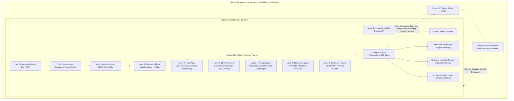

# AegisDoc: Technical Architecture & Forensic Methodology

## 1. System Overview & Core Philosophy

**AegisDoc** is a privacy-preserving, on-device document forensics platform designed to verify the authenticity of financial documents (bank statements, salary slips, loan sanction letters, tax assessments, invoices) directly on an **Android / iQOO smartphone**.

### Non-Negotiable Core Principle
> **"Sensitive financial PII (Personally Identifiable Information) must never leave the user's hardware. Verification happens inside the device enclave; only cryptographic zero-knowledge telemetry is transmitted."**

Traditional verification architectures transmit unencrypted financial PDFs or high-resolution camera scans to third-party cloud LLMs or OCR APIs. This creates catastrophic data leakage risks (GDPR, RBI KYC master directions, GLBA violations) and introduces multi-second network latencies. AegisDoc performs **100% on-device forensic analysis in sub-100ms** using client-side algorithms, hardware camera streaming, voice interfaces, and an Office Kit phone-laptop bridge.

---

## 2. Multi-Tier Architecture Diagram

---

## 3. Mathematical & Algorithmic Methodology

### Layer 1: Normalized Error Level Analysis (N-ELA)
When digital documents are manipulated (e.g. modifying an account balance from ₹25,000 to ₹1,25,000), the forged text region is either pasted from another scan or re-saved using different Discrete Cosine Transform (DCT) quantization tables.

1. The candidate document image $I_{\text{orig}}$ is re-compressed at a standardized JPEG quality factor $Q = 82\%$, yielding $I_{\text{comp}}$.
2. The absolute RGB error delta is computed for every pixel:
   $$\Delta(x, y) = \frac{1}{3}\sum_{c \in \{R,G,B\}} |I_{\text{orig}}(x,y,c) - I_{\text{comp}}(x,y,c)|$$
3. To eliminate false positives on high-contrast authentic text, we normalize block error by the local gradient energy:
   $$\text{N-ELA}(B) = \frac{\frac{1}{|B|}\sum_{(x,y) \in B} \Delta(x, y)}{\nabla_{\text{edge}}(B) + \epsilon}$$
4. Spliced blocks exhibit an $\text{N-ELA}$ ratio $> 2.6\times$ relative to the document-wide median.

### Layer 2: High-Pass Laplacian Noise Variance
Scanning sensors and printing paper substrates contain distinct microscopic grain distributions. Spliced text fragments imported from external sources carry foreign noise signatures.

1. We apply a 2D discrete Laplacian filter kernel:
   $$K_{\text{Lap}} = \begin{bmatrix} 0 & 1 & 0 \\ 1 & -4 & 1 \\ 0 & 1 & 0 \end{bmatrix}$$
2. For each sliding tile $T_i$ of size $32 \times 32$, we calculate the local high-frequency variance:
   $$\sigma^2(T_i) = \frac{1}{|T_i|}\sum_{(x,y) \in T_i} \left(L(x,y) - \mu_i\right)^2$$
3. Authentic documents show uniform variance across text strokes. Pasted patches spike at $\sigma^2(T_i) / \text{median}(\sigma^2) > 3.6\times$.

### Layer 3: Normalized Cross-Correlation Copy-Move Detector
Tamperers frequently duplicate legitimate official seals, executive signatures, or repeated zeros to inflate credit amounts.

1. Salient feature patches $P_k$ (size $48 \times 48$, high entropy variance) are extracted across document sections.
2. For all distant pairs $(P_a, P_b)$ where Euclidean distance $\text{dist}(a, b) > 180\text{px}$:
   $$\text{NCC}(P_a, P_b) = \frac{\sum (P_a - \bar{P}_a)(P_b - \bar{P}_b)}{\sqrt{\sum (P_a - \bar{P}_a)^2 \sum (P_b - \bar{P}_b)^2}}$$
3. Pairs with $\text{NCC} \ge 0.94$ and pixel delta $< 10$ are flagged as cloned regions.

### Layer 4: Typographical Baseline Alignment Forensics
Automated financial software (SAP, Finacle, Tally) generates mathematically horizontal text baselines. Manual insertion of digits in Adobe Acrobat or Photoshop creates vertical displacement jitter.

1. Horizontal scan strips across transaction rows measure the character baseline coordinate $y_{\text{base}}$.
2. Adjacent character tokens within a single certified line item are checked for baseline drift:
   $$\Delta y = |y_{\text{base}}(i) - y_{\text{base}}(i+1)|$$
3. $\Delta y \ge 4\text{px}$ flags baseline displacement tampering.

### Layer 5: Financial Logic & Semantic Sanity
1. Cross-checks chronological date order: Flags transactions dated beyond statement certification periods (e.g. 2027/2028 on a 2026 statement).
2. Verifies arithmetic checksums:
   $$\text{Closing Balance} \stackrel{?}{=} \text{Opening Balance} + \sum \text{Credits} - \sum \text{Debits}$$

### Layer 6: Composite Forgery Risk Formula
$$\text{Risk Score} = \min\left(100, \, \max\left(\sum_{i=1}^6 w_i \cdot s_i, \, 0.92 \cdot \max_{i}(s_i)\right)\right)$$
- **Score 0 – 34**: Authentic / Low Risk (Green)
- **Score 35 – 64**: Suspicious / Medium Risk (Amber)
- **Score 65 – 100**: Forged / High Risk (Red)

---

## 4. Office Kit Phone-to-Laptop Real-Time Bridge

Built to fulfill **HackTracker's 10% Office Kit rubric**, AegisDoc connects the smartphone and laptop via a local WebSocket hub:

* **Mobile Role (iQOO Phone)**: Operates as the **Secure Hardware Enclave**. It accesses the device camera, runs on-device forensics in client memory, and extracts bounding boxes.
* **Laptop Role (Auditor Terminal)**: Operates as the **Compliance Workstation**. It receives live telemetry, streams risk ratings, and permits the auditor to spotlight suspicious regions remotely.
* **Zero-Knowledge Privacy**: No document image bytes cross the network. Only bounding coordinates, confidence metrics, and forensic explanations are transmitted.
